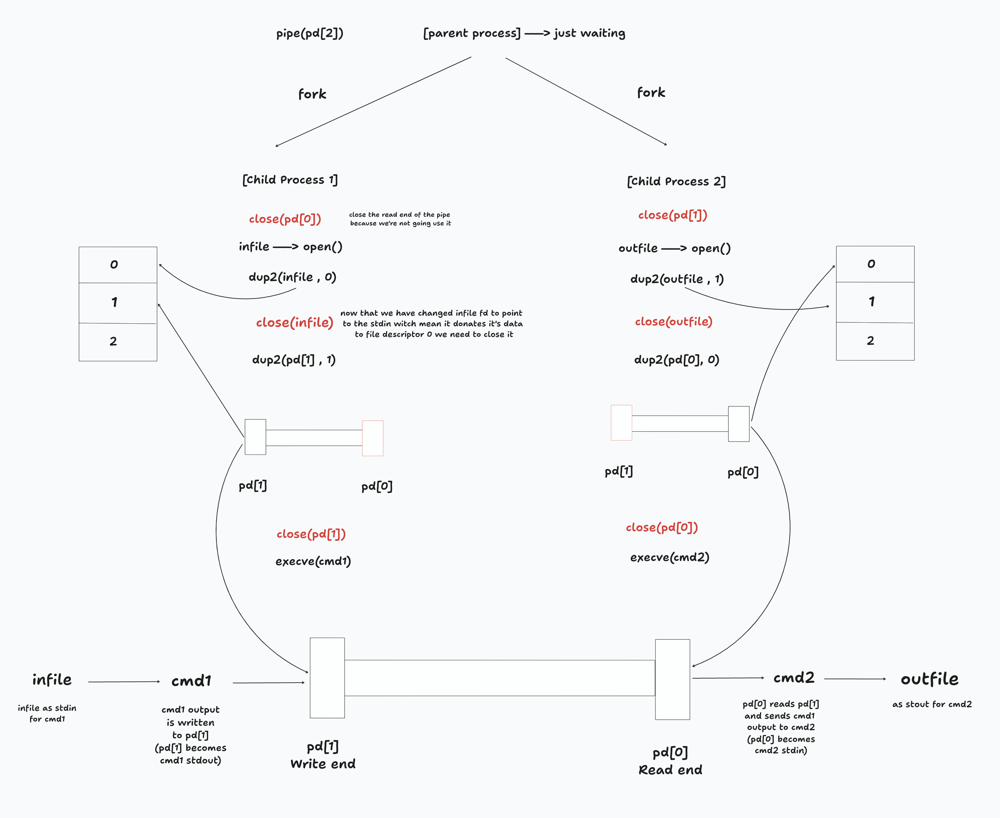

<div align="center">


# Understanding Pipelines in C
</div>


Pipelines serve as a cornerstone in Unix-like operating systems, enabling seamless communication between processes by allowing the output of one process to become the input of another. In C programming, the `pipe()` function plays a pivotal role in establishing interprocess communication channels through unidirectional pipes. Let's embark on a deeper exploration into the workings of pipelines and their implementation in C.

## Pipelines in Unix-like Systems:

In Unix-like shells such as Bash, pipelines facilitate the concatenation of multiple commands, where the output of one command seamlessly flows into the input of the next. This orchestration is achieved effortlessly using the pipe operator `|`. For instance:

```bash
command1 | command2
```

Here, the output generated by `command1` serves as the input for `command2`, effectively creating a pipeline for data flow.

## The `pipe()` Function in C:

At its core, pipes are buffered streams intricately tied to two file descriptors, meticulously set up to allow the transfer of data from one end to another. In the realm of C programming, the `pipe()` function emerges as the conduit for constructing unidirectional pipes. Its function signature reads:

```c
int pipe(int pipefd[2]);
```

The `pipefd` array encapsulates two integers, where `pipefd[0]` embodies the read end of the pipe, while `pipefd[1]` embodies the write end. Data written into `pipefd[1]` can be subsequently retrieved from `pipefd[0]`, thereby fostering communication between the paired processes.

## Visual Explanation of Pipes:

```
              [Process A]             [Process B]
                 |                        |
           (pd[0])<----- pipe -------(pd[1])
                 |                        |
           Read end                   Write end
```

This visual schema delineates the essence of pipes, showcasing `pd[0]` as the read end, where data inscribed by Process B awaits consumption by Process A. Conversely, `pd[1]` stands as the write end, channeling data penned by Process A to the eager embrace of Process B.

## Process Management in C:

In C programming, managing processes when using pipelines requires using a set of functions like `fork()`, `execve()`, `dup2()`, and `close()`.

- **`fork()`:** This function creates a new process by making a copy of the current one. When `fork()` is called, two processes are created: the parent and the child. The parent process continues its execution from where `fork()` was called, while the child process starts from the same point but with a different process ID (PID). Additionally, if a pipe was previously created using `pipe()`, the file descriptors obtained from the pipe are shared between the parent and child processes. This means that data written to one descriptor can be read from the other. `fork()` essentially duplicates the parent's memory and file descriptors for the child, allowing them to share information and work together.

## Integration with `fork()` for Interprocess Communication:

Combining `fork()` with `pipe()` opens up opportunities for communication between processes. After the parent and child processes are created, they both have access to the same file descriptors, which are provided by the `pipe()`. This shared connection allows them to easily exchange data through the pipe. This communication isn't just about transferring data; it enables synchronization and collaboration between processes. This collaboration is essential for tasks like shell scripting and concurrent programming, allowing for more complex and efficient operations.


- **`execve()`:** This function is like the conductor of an orchestra. It helps start a new process by replacing the current process with a new one based on a specific file. Imagine you have a new piece of music (the new process), and `execve()` is the conductor who starts playing it, replacing the old piece.

- **`dup2()`:** Think of `dup2()` as a magic spell that makes an exact copy of one magic wand (file descriptor) and puts it into another wand. This is often used to redirect where the input and output of a process go. For example, if you want the output to go somewhere different than usual, `dup2()` can make that happen by copying the output wand to a new location.

- **`close()`:** When a file is no longer needed, `close()` is like closing a book after finishing reading it. It's a way to let the system know that a file or resource is done being used, freeing up space and resources for other tasks.

In simpler terms, `execve()` starts a new task, `dup2()` can change where the task's input and output go, and `close()` finishes up and cleans things up when the task is done.

### Visual Explanation of `pipex` Function:

```
              [Parent Process]
                  /       \
   [Child Process 1]       [Child Process 2]
    (cmd1, input)           (cmd2, output)
         |                       |
         |                       |
    [Pipe Input]           [Pipe Output]
```



When we use `fork()` along with `pipe()` for interprocess communication, it's like a parent creating two children. One child, let's call it Child Process 1, is responsible for taking input from `cmd1`. The other child, Child Process 2, is ready to give the results to `cmd2`. The pipe acts like a bridge between these children, making it easy for them to share information. It's like a secret passage that allows data to flow smoothly from input to output, making communication between the processes effortless.

### Data Flow:

- The input data originates from the designated input file. It then travels through the first process (`cmd1`), which acts upon it according to its instructions.
- The processed data is then sent to the write end (`pd[1]`) of the pipe, where it awaits consumption by the second process (Child Process 2). This data can be read by Child Process 2 through its standard input (`stdin`).

This explanation unveils the intricate workings of pipelines and interprocess communication in C, inviting exploration and innovation in the realm of programming.

## Resources

https://www.codequoi.com/en/pipe-an-inter-process-communication-method/

https://www.geeksforgeeks.org/pipe-system-call/

https://www.it.uu.se/education/course/homepage/dsp/vt21/modules/module-2/pipeline/

https://phoenixnap.com/kb/bash-heredoc#:~:text=A%20HereDoc%20is%20a%20multiline,neater%20and%20easier%20to%20understand

https://www.codequoi.com/en/handling-a-file-by-its-descriptor-in-c/
